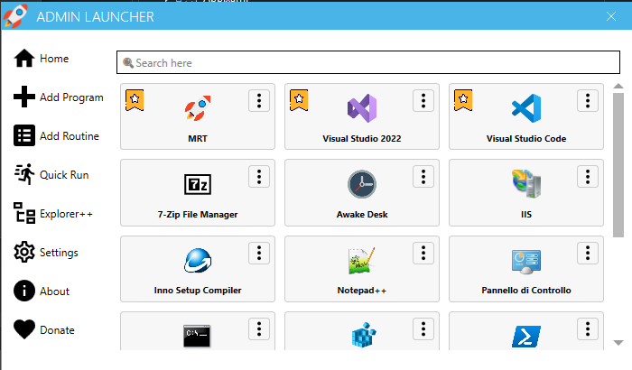
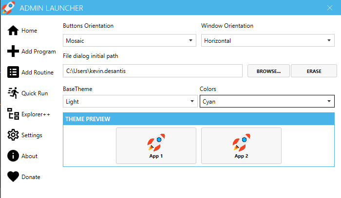

# Download & Installation
You can download the application from the [Release tab](https://github.com/kdesantis/AdminLauncher/releases). Nothing could be simpler.

# Home

    

**Home panel** contains a button for all added programs and routines. 
Each element has a button that allows you to **edit** and **delete** the relative element.

The ordering of the buttons follows this logic:
1. First the routines in alphabetical order,
2. the programs signed as favorites in alphabetical order
3. the rest of the programs in alphabetical order

To launch a program or routine, just left-click.
Or you can do it from the menu bar icon

If you need to launch a program once, you can use the **Quick Run** button which allows you to select an executable and launch it without adding it to the home folder.

If you need to make changes to files with maximum privileges, we have integrated the third-party software Explorer++ by David Erceg. Downloads and updates to the latest version are automatic.

**Be careful**, if you try to close the application it **will not close** but will be hidden, 
to show it just **double click** on the icon in the task bar. To close the application 
permanently right click on the icon in the task bar and select “Close” in the menu.

    

# Add Program

You have two ways to add your favorite programs to the home: **Assisted Mode** and **Manual Mode**.

## Assisted Mode

    

The **assisted mode** allows you to add programs to the home having a list of all (or almost all) of the programs installed on your system.
Search and select all the programs you want to add to the home and click the appropriate button.

It is recommended that you use this feature when **first configuring**.

## Manual Mode

    

Manual mode instead allows you to import those programs that are not installed or that require specific arguments.

To add a new product is import:
* Enter the **name** of the product;
* Enter the **path** to the executable (the **link** path is also fine). You can either do this through the **browser**. Keep in mind that the supported executables are not only *EXE* but also *BAT, CMD, VBS, MSC, MSI and PS1* formats
or **paste** the path into the textbox
* If necessary you can define the **arguments** to be passed to the launch;
* If necessary you can use a **custom icon**;
* Import the program with **Favorite**.

Once defined, click "**Save**"

# Add Routine

    

A routine represents a series of programs that you want to run at the same time.
The page can be reached from the “**Add Routine**” button in the menu.

To add a new routine you need to:
* enter the **name** of the routine.
* If necessary you can use a **custom icon**;
* select **programs** from those previously entered.

Once defined, click save

# Settings

    

In the Settings tab, you can choose the orientation of the window between ‘**Vertical**’ and ‘**Horizontal**’ and the layout of the start-up tab buttons between ‘**Vertical**’ and ‘**Mosaic**’.

You can also choose whether or not to set a fixed **start path** for file selection windows (quick run or add program).

The system has **2 basic themes**, one light and one dark and a **range of colours** that interact with the buttons and other controls
